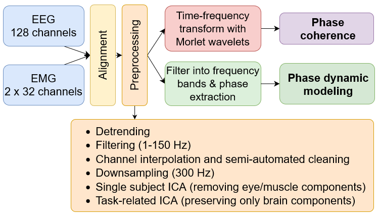

# Corticomuscular Coupling Analysis

## Workflow



## Overview

This project analyzes corticomuscular coupling and functional connectivity using MATLAB. The analysis pipeline consists of preprocessing and connectivity analysis stages.

## Getting Started

### Step 1: Preprocessing

Run the preprocessing files inside the `preprocessing/` folder **in alphabetical order**:

1. `a_main_preprocessing.m`
2. `b_local_ica_single_subject.m`
3. `c_check_ica_comps_bysubs.m`
4. `d_local_ica_single_task.m`
5. `e_do_dipfit.m`
6. `f_check_ica_comps_bytasks.m`

### Step 2: Connectivity Analysis

#### 2.1 Create Configuration

- Open `create_config.m` script
- Adjust `root_path` and other settings as required (e.g., which tasks to run)
- Run the script

The config file will be created and saved in the `.\configs\` folder.

#### 2.2 Run Connectivity Analysis

Execute `main_connectivity.m` with two arguments: `config_path` and `job_idx`

**Example:**
```matlab
main_connectivity('D:\Experiments\corticomuscular_analysis\configs\config_loc_test_cwt_pc_dbi.mat', 1)
```

Results are saved in `.\data\real\` folder.

**Running for Multiple Subjects and Tasks:**

- Use `job_idx = 0` to run all jobs in parallel (requires MATLAB Parallel Toolbox)
- Or run jobs in a loop:

```matlab
for ijob = 1:8  % 2 subjects × 4 tasks each (C task excluded)
    main_connectivity(config_path, ijob)
end
```

### Step 3: Analysis of Results

See and run individual scripts inside the `.\code\analysis\` folder:

- **`<method>_group_analysis`** scripts: Collect results from individuals and merge into a single struct
- **`<method>_group_plots`** scripts: Load group struct and generate plots

**Important Notes:**

- Update the config file path in the analysis scripts (settings are imported from config)
- Results are saved in `.\analysis\<method>\` folder
- Currently configured for two subjects (one healthy, one patient)
- All analysis scripts require both groups to run
- Plotting functions that don't work with current configs are commented out (e.g., topo plots with only one channel, avgcen and boxplots with single values per group)

**Requirements:**

- EEGLAB toolbox is required for group plotting scripts: https://sccn.ucsd.edu/eeglab/download.php

## References

For detailed methodology and results, see our paper:
[10.1109/TBME.2024.3517089](https://ieeexplore.ieee.org/document/10835798/)

## Contact

For more information, please contact: nina.omejc@ijs.si